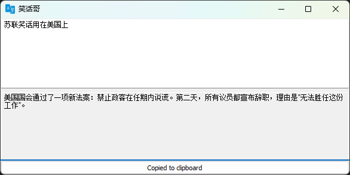

# 简单的翻译工具
中英互译，也可以通过配置 使之翻译其他语言，本质上只是一个 LLM 大语言模型的API调用而已；


**为什么要写这个** 
- 使用 GPT/DeepSeek 等，无法配置系统提示词 或者不太方便；
- 使用类似其他第三方工具或桌面工具时，总是要配置一个系统提示词 太麻烦了；
- 使用类似 cherry studio，每次翻译完要开一个新会话 否则长期翻译可能会超出token限制；

**使用说明**
- 下载 exe 可执行文件，或者你也可以直接本地构建，执行 `build.bat` 即可
- 同目录下 放一个 conf 文件，内容如下即可
```conf
LLM openai
KEY xxxxx
```

如果国内环境只有DeepSeek，也是一样的，加两行：
```conf
BASE https://api.deepseek.com
MODEL deepseek-chat
```


可选配置 SYSTEM 提示词 像这样：
```conf
SYSTEM """你是一个... ... """
```

也就是说，本地模型也是一样的方式， ollama 等同样支持；所以本质上，这就是个简单的一次性生成工具，完全可以利用 LLM 的能力，移做他用；




其他配置：
```conf
PARAMETER TITLE 翻译官
```

# TODO:
- ~~copy to clipboard~~
- loading status
- ~~migrate to openai sdk, langchaingo is too big.~~
- ~~multi conf profile~~
- ~~custom title~~
- ~~shortcut~~
- ~~system tray icon~~
- ~~always on the top~~
- screenshot and ocr
